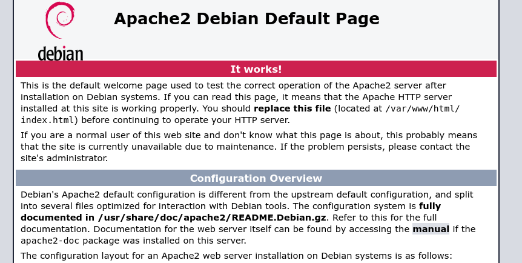

# JUNO #

This is Juno from PTD, 

## Nmap scan

```
 Nmap 7.95 scan initiated Sun May  4 03:01:25 2025 as: /usr/lib/nmap/nmap --privileged -sC -sV -oN scan.txt -Pn 10.150.150.224
Nmap scan report for 10.150.150.224
Host is up (0.14s latency).
Not shown: 999 closed tcp ports (reset)
PORT   STATE SERVICE VERSION
80/tcp open  http    Apache httpd 2.4.41 ((Ubuntu))
|_http-title: Apache2 Debian Default Page: It works
|_http-server-header: Apache/2.4.41 (Ubuntu)

```

Just a single port i.e 80,

lets visit it on the web browser

ok it gives just the default page



ok so i decided to FUZZ for hidden files and folders

```
ffuf -u http://10.150.150.224/FUZZ -w /usr/share/wordlists/dirb/big.txt -e .php,.sql,.env

        /'___\  /'___\           /'___\       
       /\ \__/ /\ \__/  __  __  /\ \__/       
       \ \ ,__\\ \ ,__\/\ \/\ \ \ \ ,__\      
        \ \ \_/ \ \ \_/\ \ \_\ \ \ \ \_/      
         \ \_\   \ \_\  \ \____/  \ \_\       
          \/_/    \/_/   \/___/    \/_/       

       v2.1.0-dev
________________________________________________

 :: Method           : GET
 :: URL              : http://10.150.150.224/FUZZ
 :: Wordlist         : FUZZ: /usr/share/wordlists/dirb/big.txt
 :: Extensions       : .php .sql .env 
 :: Follow redirects : false
 :: Calibration      : false
 :: Timeout          : 10
 :: Threads          : 40
 :: Matcher          : Response status: 200-299,301,302,307,401,403,405,500
________________________________________________

login.php               [Status: 200, Size: 1213, Words: 400, Lines: 55, Duration: 155ms]
registered.php          [Status: 403, Size: 9, Words: 1, Lines: 1, Duration: 139ms]
server-status           [Status: 403, Size: 279, Words: 20, Lines: 10, Duration: 153ms]
:: Progress: [81876/81876] :: Job [1/1] :: 248 req/sec :: Duration: [0:05:55] :: Errors: 0 ::
```

Oh ok so there are a couple of endpoints so lets visite them and see ,

visiting ```login.php``` 


so we have provide some kind of key or pin, BUT from where 

anyways there is a link do download the android apk so lets download it and see

I downloaded the android apk and decompiled it using jadx, and started to search for 

i am kinda new to this so i just look for login or authentication and found somthing


just by looking at it it looks like there is some comparison between the users input and some already existing string

lets check what the already existing string could be 


oh ok so there are hard coded strings somewhere in the apk, this part took me a couple of minutes then i decided to ask ChatGPT

so i had to visit ```res/values/strings.xml``` to see the hard coded values


Ok so we see the values and now we can login 


Nice we get another flag but the other is kinda encoded, i dont know why people will put as through this stress, 

now how do i figure out what the encoding is


any wasy after a few search, found out it was [ASCII shif cipher](https://www.dcode.fr/ascii-shift-cipher)

